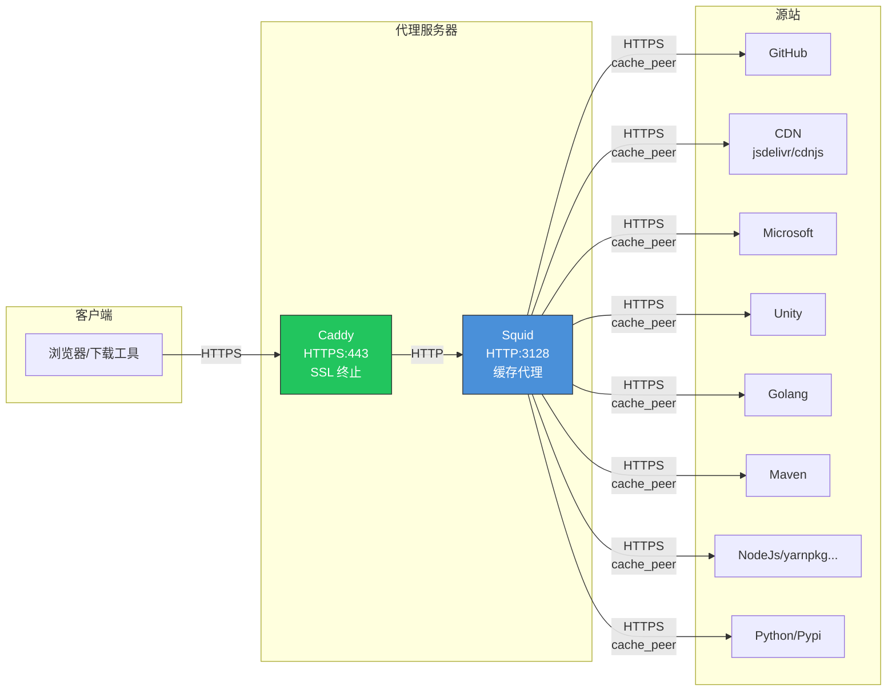

# Squid 缓存代理配置

## 架构



**流程说明：**

1. **Caddy** - SSL 终止，提供 HTTPS 入口，转发请求到 Squid
2. **Squid** - HTTP 反向代理缓存，通过 `cache_peer` (TLS) 连接源站
3. **缓存命中** - Squid 直接返回缓存内容，不请求源站

## 目录结构

```
squid/
├── squid.Dockerfile            # 容器镜像构建
├── supervisor/
│   └── supervisord.conf        # supervisor 配置 (进程管理 + 日志轮转)
├── etc/
│   ├── squid.conf              # 主配置文件
│   └── conf.d/                 # 模块化配置目录
│       ├── 00-unreal-engine.conf   # Unreal Engine CDN
│       ├── 10-github.conf          # GitHub 资产
│       ├── 15-github-pages.conf    # GitHub Pages/静态站点/Helm 仓库
│       ├── 20-cdn.conf             # 主流 CDN (jsDelivr, cdnjs, etc.)
│       ├── 30-microsoft.conf       # 微软下载 (VS, VS Code, Windows Update)
│       ├── 35-unity.conf           # Unity 下载
│       ├── 40-golang.conf          # Golang 模块代理
│       ├── 45-maven.conf           # Maven/Gradle 仓库
│       ├── 50-python.conf          # Python/PyPi仓库
│       ├── 55-nodejs.conf          # NodeJs/yarn仓库
│       └── 99-deny-store-id.conf   # 默认拒绝 store_id
└── script/
    ├── store_id_rewriter.py    # Store ID 重写程序
    └── domains/                # 域名配置模块
        ├── __init__.py
        ├── github.py
        ├── cdn.py
        ├── microsoft.py
        ├── unity.py
        ├── unreal_engine.py
        ├── golang.py
        ├── maven.py
        ├── python.py
        └── nodejs.py
```

## Docker/Podman 部署

```bash
# 构建镜像
podman build -f squid.Dockerfile -t squid-cache .

# 运行容器
# 注意这里只挂载squid.conf文件和conf.d目录，因为 /etc/squid 下有其他文件，不能掩盖，否则会启动失败。
podman run -d \
  --name squid \
  -p 3128:3128 \
  -v /path/to/squid/etc/squid.conf:/etc/squid/squid.conf:ro \
  -v /path/to/squid/etc/conf.d:/etc/squid/conf.d:ro \
  -v /path/to/squid/script:/opt/squid/script:ro \
  -v /path/to/squid/cache:/var/spool/squid \
  -v /path/to/squid/logs:/var/log/squid \
  squid-cache
```

## 手动安装

```bash
# 复制配置文件
cp -r etc/squid.conf /etc/squid/
cp -r etc/conf.d /etc/squid/

# 复制脚本 (包括 domains 目录)
mkdir -p /opt/squid/script
cp -r script/* /opt/squid/script/
chmod +x /opt/squid/script/store_id_rewriter.py

# 创建缓存目录
mkdir -p /var/spool/squid
chown squid:squid /var/spool/squid

# 初始化缓存
squid -z

# 验证配置
squid -k parse

# 启动/重载
squid -k reconfigure
```

## Store ID 重写策略

脚本对不同类型的 URL 采用不同策略：

### 1. 安全移除参数的域名

参数仅用于签名/跟踪，不影响返回内容：

| 类型     | 域名示例                               | 说明            |
| -------- | -------------------------------------- | --------------- |
| GitHub   | `release-assets.githubusercontent.com` | AWS S3 签名参数 |
| 微软下载 | `download.microsoft.com`               | 签名/跟踪参数   |
| Unity    | `download.unity3d.com`                 | CDN 参数        |
| CDNJS    | `cdnjs.cloudflare.com`                 | 版本在路径中    |
| Golang   | `proxy.golang.org`                     | 版本在路径中    |
| Maven    | `repo1.maven.org`                      | 版本在路径中    |

### 2. 需要版本号才缓存的 CDN

如 `cdn.jsdelivr.net`, `unpkg.com`：

- `@1.2.3` - 有版本号，长期缓存 (30天-365天)
- `@latest` 或无版本 - **不重写 store_id**，短期缓存 (10分钟-1小时)

### 3. 不处理的 API 端点

参数会影响返回内容，不做 store_id 重写：

- `fonts.googleapis.com` - `family` 参数决定 CSS 内容
- `api.nuget.org` - API 查询
- `update.code.visualstudio.com` - 更新检查
- `packages.unity.com` - 元数据查询

## 添加新的缓存域名

### 1. 添加 Squid ACL 和 refresh_pattern

在 `etc/conf.d/` 下创建新文件，例如 `40-example.conf`:

```squid
# 区分下载和 API
acl example_downloads dstdomain cdn.example.com
acl example_api dstdomain api.example.com

cache allow example_downloads
cache allow example_api

# 只对下载做 store_id 重写
store_id_access allow example_downloads

# 下载: 长期缓存
refresh_pattern -i cdn\.example\.com 10080 100% 43200 override-expire ignore-reload ignore-no-store ignore-private ignore-must-revalidate
# API: 短期缓存
refresh_pattern -i api\.example\.com 10 50% 60
```

### 2. 添加 Store ID 重写规则

在 `script/domains/` 下创建新文件，例如 `example.py`:

```python
# Example CDN 域名配置
EXAMPLE_SAFE_STRIP_DOMAINS = [
    r'^https?://cdn\.example\.com/',
]
```

然后在 `script/domains/__init__.py` 中导入：

```python
from .example import EXAMPLE_SAFE_STRIP_DOMAINS

ALL_SAFE_STRIP_PATTERNS = (
    # ... 已有配置 ...
    EXAMPLE_SAFE_STRIP_DOMAINS +
)
```

## 测试 Store ID 重写

```bash
# 测试 GitHub Release (应移除参数)
echo "https://release-assets.githubusercontent.com/xxx?X-Amz-Algorithm=AWS4" | python3 /opt/squid/script/store_id_rewriter.py
# 输出: OK store-id=https://release-assets.githubusercontent.com/xxx

# 测试 jsDelivr 带版本 (应移除参数)
echo "https://cdn.jsdelivr.net/npm/vue@3.2.0/dist/vue.js" | python3 /opt/squid/script/store_id_rewriter.py
# 输出: OK store-id=https://cdn.jsdelivr.net/npm/vue@3.2.0/dist/vue.js

# 测试 jsDelivr @latest (不应重写)
echo "https://cdn.jsdelivr.net/npm/vue@latest/dist/vue.js" | python3 /opt/squid/script/store_id_rewriter.py
# 输出: ERR

# 测试 fonts.googleapis.com (不应重写，参数影响内容)
echo "https://fonts.googleapis.com/css?family=Roboto" | python3 /opt/squid/script/store_id_rewriter.py
# 输出: ERR

# 测试 Maven SNAPSHOT (不应重写)
echo "https://repo1.maven.org/maven2/com/example/1.0-SNAPSHOT/example.jar" | python3 /opt/squid/script/store_id_rewriter.py
# 输出: ERR
```

## 查看缓存命中

```bash
# 查看日志中的缓存状态
tail -f /var/log/squid/access.log | grep -E 'HIT|MISS'

# 查看缓存目录使用情况
du -sh /var/spool/squid/

# 查看缓存索引状态
ls -la /var/spool/squid/swap.state
```

## 日志轮转

supervisor 配置中包含自动日志轮转：

- 每小时检查日志大小
- 超过 30MB 自动执行 `squid -k rotate`
- 保留 5 个轮转文件 (`logfile_rotate 5`)

手动轮转：

```bash
podman exec squid squid -k rotate
```

## 查询缓存信息

```bash
curl -s "http://127.0.0.1:3128/squid-internal-mgr/storedir"
```
