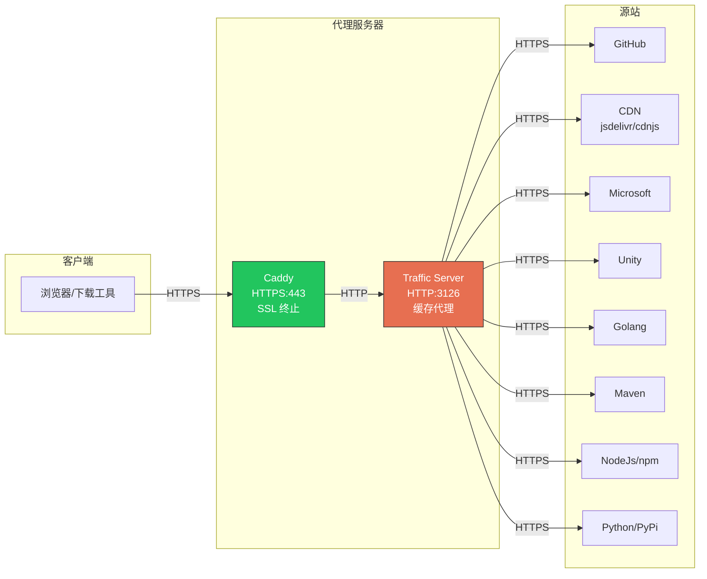

# Apache Traffic Server 缓存代理配置

## 架构



**流程说明：**

1. **Caddy** - SSL 终止，提供 HTTPS 入口，转发请求到 ATS
2. **ATS** - HTTP 反向代理缓存，通过 HTTPS 连接源站
3. **缓存命中** - ATS 直接返回缓存内容，不请求源站

## 为什么选择 Apache Traffic Server

| 特性 | Squid | ATS | 说明 |
|-----|-------|-----|------|
| 多线程 | ⚠️ 需 Rock | ✅ 原生 | ATS 原生多线程，无需复杂配置 |
| 容器兼容 | ⚠️ IPC 问题 | ✅ 好 | 无共享内存依赖 |
| 磁盘缓存 | ✅ | ✅ | 都支持 |
| 大规模部署 | 中等 | 极大规模 | Yahoo/LinkedIn/Apple 生产使用 |
| 配置复杂度 | 中等 | 较高 | ATS 配置文件较多 |

## 目录结构

```
trafficserver/
├── trafficserver.Dockerfile     # 容器镜像构建 (ATS 10.x 源码编译)
├── build-trafficserver-image.sh # 构建脚本 (支持源码包缓存)
├── docker-compose.yml           # Docker Compose 配置
├── supervisor/
│   └── supervisord.conf         # supervisor 进程管理配置
├── etc/
│   ├── records.yaml             # 主配置文件 (ATS 10.x YAML 格式)
│   ├── remap.config             # URL 重映射 (类似 cache_peer)
│   ├── cache.config             # 缓存策略 (类似 refresh_pattern)
│   ├── storage.config           # 磁盘缓存配置
│   ├── hosting.config           # 缓存分区配置
│   ├── logging.yaml             # 日志配置
│   ├── sni.yaml                 # SNI/TLS 配置
│   ├── ip_allow.yaml            # IP 访问控制
│   ├── bypass_auth.conf         # header_rewrite 规则
│   ├── parent.config            # 父代理配置
│   ├── plugin.config            # 全局插件配置
│   ├── ssl_multicert.config     # SSL 证书配置
│   └── volume.config            # 缓存卷配置
├── body_factory/
│   └── default/                 # 错误页面模板
├── ca-certificates/             # 自定义 CA 证书
├── download/                    # 源码包缓存目录
└── README.md
```

## Docker/Podman 部署

### 构建镜像

```bash
# 使用构建脚本 (推荐，支持源码包缓存)
./build-trafficserver-image.sh

# 或手动构建 (需要挂载下载目录以缓存源码包)
docker build -v $(pwd)/download:/download -f trafficserver.Dockerfile -t trafficserver-cache .
```

### 使用 Docker Compose 运行

```bash
# 创建网络 (如果不存在)
docker network create internal-backend
docker network create internal-frontend

# 启动服务
docker-compose up -d

# 查看日志
docker-compose logs -f
```

### 手动运行容器

```bash
podman run -d                   \
  --name trafficserver          \
  --network=host                \
  -v /path/to/trafficserver/etc:/etc/trafficserver:ro \
  -v /path/to/trafficserver/cache:/var/cache/trafficserver \
  -v /path/to/trafficserver/logs:/var/log/trafficserver \
  trafficserver-cache
```

### 高并发配置

ATS 10.x 使用嵌套 YAML 结构，在 `records.yaml` 中配置：

```yaml
records:
  # 启用自动配置线程数 (基于 CPU 核心数)
  exec_thread:
    autoconfig:
      enabled: 1
      # 线程数 = CPU核心数 * scale，scale=1.5 表示 8核=12线程
      scale: 1.5
    # 限制最大线程数为 16
    limit: 16
  
  # 最大连接数 (2百万)
  net:
    connections_throttle: 2000000
```

### 目录配置

启动脚本支持通过环境变量配置目录：

```bash
# 默认使用脚本目录下的 cache 和 logs
TRAFFICSERVER_CACHE_DIR=/data/trafficserver/cache \
TRAFFICSERVER_LOG_DIR=/data/trafficserver/logs \
./start-trafficserver-pods.sh
```

## 配置文件说明

### records.yaml - 主配置 (ATS 10.x 格式)

ATS 10.x 使用嵌套 YAML 结构，配置项名称变化：

| ATS 9.x 格式 | ATS 10.x 格式 |
|-------------|--------------|
| `proxy.config.http.server_ports: "3126"` | `http: server_ports: "3126"` |
| `proxy.config.exec_thread.autoconfig: 1` | `exec_thread: autoconfig: enabled: 1` |
| `proxy.config.cache.ram_cache.size: 2G` | `cache: ram_cache: size: 2G` |
| `proxy.config.dns.nameservers: "..."` | `dns: nameservers: "..."` |

示例配置：

```yaml
records:
  # 反向代理模式
  reverse_proxy:
    enabled: 1
  
  url_remap:
    remap_required: 1
  
  # HTTP 配置
  http:
    server_ports: "3126"
    keep_alive_enabled_in: 1
    keep_alive_enabled_out: 1
    cache:
      http: 1
      heuristic_min_lifetime: 3600
      heuristic_max_lifetime: 86400
  
  # DNS 配置 (不使用系统 DNS)
  dns:
    nameservers: "223.5.5.5 119.29.29.29"
    resolv_conf: "NULL"
  
  # SSL 配置 (连接源站)
  ssl:
    client:
      CA:
        cert:
          filename: /etc/ssl/certs/ca-certificates.crt
      verify:
        server:
          policy: ENFORCED
```

### remap.config - URL 重映射

类似 Squid 的 `cache_peer`，定义源站映射。

**注意**: 当 Caddy 转发 HTTP 请求到 ATS 时，左侧使用 `http://`，右侧使用 `https://` 连接源站：

```
# 格式: map <接收请求> <转发到源站>
map http://cdn.jsdelivr.net/ https://cdn.jsdelivr.net/
map http://github.com/ https://github.com/

# 使用插件
map http://release-assets.githubusercontent.com/ https://release-assets.githubusercontent.com/ @plugin=cachekey.so @pparam=--remove-all-params=true
map http://github.com/ https://github.com/ @plugin=header_rewrite.so @pparam=bypass_auth.conf
```

### sni.yaml - SNI/TLS 配置

配置连接特定源站时的 TLS 行为，解决 CDN 证书不匹配问题：

```yaml
sni:
  # Microsoft CDN - 证书可能不匹配 SNI
  - fqdn: dl.delivery.mp.microsoft.com
    verify_server_policy: DISABLED
  - fqdn: '*.mp.microsoft.com'
    verify_server_policy: DISABLED
  
  # 默认配置
  - fqdn: "*"
    verify_server_policy: PERMISSIVE
```

### cache.config - 缓存策略

类似 Squid 的 `refresh_pattern`，定义缓存时长：

```
# 长期缓存 (365天)
dest_domain=cdnjs.cloudflare.com action=ignore-no-cache ttl-in-cache=365d

# 短期缓存 (1小时)
dest_domain=api.nuget.org action=ignore-no-cache ttl-in-cache=1h
```

### storage.config - 磁盘缓存

```
# 200GB 磁盘缓存
/var/cache/trafficserver 200G
```

## Caddy 配置示例

Caddy 作为 HTTPS 前端，转发到 ATS：

```caddyfile
cdn.example.com {
    reverse_proxy trafficserver:3126 {
        header_up Host {upstream_hostport}
    }
}

# 或使用通配符
*.githubusercontent.com {
    reverse_proxy trafficserver:3126 {
        header_up Host {host}
    }
}
```

## 缓存时长策略

| 类型 | 域名示例 | 缓存时长 | 说明 |
|-----|---------|---------|------|
| 版本化 CDN | cdnjs.cloudflare.com | 365 天 | 版本在 URL 中 |
| 包文件 | files.pythonhosted.org | 365 天 | 不可变内容 |
| GitHub Release | release-assets.githubusercontent.com | 30 天 | 签名参数可忽略 |
| npm CDN | cdn.jsdelivr.net | 30 天 | 带版本号 |
| 文档站点 | cppreference.com | 3 天 | 可能更新 |
| API/元数据 | api.nuget.org | 10 分钟 | 频繁变化 |

## 常用命令

```bash
# 进入容器
docker exec -it trafficserver bash

# 检查配置
traffic_ctl config status

# 查看所有缓存相关指标
traffic_ctl metric match cache

# 查看缓存统计
traffic_ctl metric get proxy.process.cache.bytes_used      # 已使用缓存
traffic_ctl metric get proxy.process.cache.bytes_total     # 总缓存大小

# 查看缓存命中
traffic_ctl metric get proxy.process.cache.hits            # 缓存命中次数
traffic_ctl metric get proxy.process.cache.misses          # 缓存未命中次数

# 重新加载配置 (不重启)
traffic_ctl config reload

# 清空缓存
traffic_ctl storage offline /var/cache/trafficserver
rm -rf /var/cache/trafficserver/*
traffic_ctl storage online /var/cache/trafficserver

# 查看日志
tail -f /var/log/trafficserver/access.log
tail -f /var/log/trafficserver/diags.log
```

### 查看缓存文件大小

```bash
# 逻辑大小 (配置的最大值)
ls -lh /var/cache/trafficserver/cache.db

# 实际占用的磁盘空间 (稀疏文件)
du -h /var/cache/trafficserver/cache.db

# 同时显示
echo "逻辑大小: $(ls -lh /var/cache/trafficserver/cache.db | awk '{print $5}')"
echo "实际占用: $(du -h /var/cache/trafficserver/cache.db | awk '{print $1}')"
```

**说明**: ATS 使用稀疏文件，`ls` 显示配置的最大大小，`du` 显示实际占用空间。

## 与 Squid 配置对照

| Squid | ATS | 说明 |
|-------|-----|------|
| `cache_peer` | `remap.config` | 源站定义 |
| `refresh_pattern` | `cache.config` | 缓存策略 |
| `cache_dir` | `storage.config` | 磁盘缓存 |
| `workers` | `exec_thread.limit` | 并发数 |
| `cache_mem` | `cache.ram_cache.size` | 内存缓存 |
| `store_id_program` | `@plugin=cachekey.so` | 缓存键处理 |
| `acl` | `ip_allow.yaml` | 访问控制 |
| `dns_nameservers` | `dns.nameservers` | DNS 服务器 |

## 添加新的缓存域名

### 1. 添加 URL 重映射 (remap.config)

```
map https://new-cdn.example.com/ https://new-cdn.example.com/
```

### 2. 添加缓存策略 (cache.config)

```
# 长期缓存
dest_domain=new-cdn.example.com suffix=.js action=ignore-no-cache ttl-in-cache=365d
dest_domain=new-cdn.example.com suffix=.css action=ignore-no-cache ttl-in-cache=365d

# 默认中期缓存
dest_domain=new-cdn.example.com action=ignore-no-cache ttl-in-cache=7d
```

### 3. 重新加载配置

```bash
podman exec trafficserver traffic_ctl config reload
```

## 故障排查

### 检查源站连接

```bash
# 查看源站连接状态
traffic_ctl metric get proxy.process.http.origin_server_connections_currently_open

# 查看错误计数
traffic_ctl metric get proxy.process.http.origin_server_total_transactions_count
```

### 检查缓存命中率

```bash
# 查看缓存统计
traffic_ctl metric match cache

# 缓存命中
traffic_ctl metric get proxy.process.cache.hits

# 缓存未命中
traffic_ctl metric get proxy.process.cache.misses

# 计算命中率
# hits / (hits + misses) * 100%
```

### 调试日志

在 `records.yaml` 中启用调试 (ATS 10.x 格式)：

```yaml
records:
  diags:
    debug:
      enabled: 1
      tags: "http|cache"
```

## ATS 10.x 升级注意事项

从 ATS 9.x 升级到 10.x 需要注意：

1. **配置格式变化**: `records.yaml` 从扁平格式改为嵌套 YAML 格式
2. **移除的配置项**:
   - `proxy.config.http.anonymize_insert_client_ip`
   - `proxy.config.http.cache.max_object_size`
   - `proxy.config.exec_thread.autoconfig` (改为 `exec_thread.autoconfig.enabled`)
3. **构建系统**: 从 autotools 改为 CMake
4. **依赖变化**: 需要 glibc (不支持 musl/Alpine)

## 参考文档

- [ATS 10.x records.yaml 文档](https://docs.trafficserver.apache.org/en/10.0.x/admin-guide/files/records.yaml.en.html)
- [ATS 配置变量参考](https://docs.trafficserver.apache.org/en/latest/admin-guide/configuration.en.html)
- [remap.config 文档](https://docs.trafficserver.apache.org/en/latest/admin-guide/files/remap.config.en.html)
- [cache.config 文档](https://docs.trafficserver.apache.org/en/latest/admin-guide/files/cache.config.en.html)
