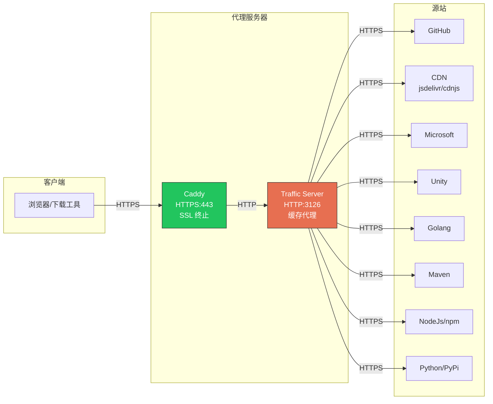

# Apache Traffic Server 缓存代理配置

## 架构



**流程说明：**

1. **Caddy** - SSL 终止，提供 HTTPS 入口，转发请求到 ATS
2. **ATS** - HTTP 反向代理缓存，通过 HTTPS 连接源站
3. **缓存命中** - ATS 直接返回缓存内容，不请求源站

## 为什么选择 Apache Traffic Server

| 特性 | Squid | ATS | 说明 |
|-----|-------|-----|------|
| 多线程 | ⚠️ 需 Rock | ✅ 原生 | ATS 原生多线程，无需复杂配置 |
| 容器兼容 | ⚠️ IPC 问题 | ✅ 好 | 无共享内存依赖 |
| 磁盘缓存 | ✅ | ✅ | 都支持 |
| 大规模部署 | 中等 | 极大规模 | Yahoo/LinkedIn/Apple 生产使用 |
| 配置复杂度 | 中等 | 较高 | ATS 配置文件较多 |

## 目录结构

```
trafficserver/
├── trafficserver.Dockerfile     # 容器镜像构建
├── supervisor/
│   └── supervisord.conf         # supervisor 配置
├── etc/
│   ├── records.yaml             # 主配置文件
│   ├── remap.config             # URL 重映射 (类似 cache_peer)
│   ├── cache.config             # 缓存策略 (类似 refresh_pattern)
│   ├── storage.config           # 磁盘缓存配置
│   ├── hosting.config           # 缓存分区配置
│   └── logging.yaml             # 日志配置
└── README.md
```

## Docker/Podman 部署

### 构建和运行

```bash
# 构建镜像
podman build -f trafficserver.Dockerfile -t trafficserver .

# 运行容器
podman run -d                   \
  --name trafficserver          \
  --network=host                \
  -v /path/to/trafficserver/etc:/etc/trafficserver:ro \
  -v /path/to/trafficserver/cache:/var/cache/trafficserver \
  -v /path/to/trafficserver/logs:/var/log/trafficserver \
  trafficserver
```

### 高并发配置

ATS 是多线程架构，在 `records.yaml` 中配置：

```yaml
records:
  # 启用自动配置线程数 (基于 CPU 核心数)
  proxy.config.exec_thread.autoconfig: 1
  # 线程数 = CPU核心数 * scale，scale=1.5 表示 8核=12线程
  proxy.config.exec_thread.autoconfig.scale: 1.5
  # 限制最大线程数为 16 (适用于 8核及以上 CPU)
  proxy.config.exec_thread.limit: 16
  
  # 最大连接数 (2百万)
  proxy.config.net.connections_throttle: 2000000
```

### 目录配置

启动脚本支持通过环境变量配置目录：

```bash
# 默认使用脚本目录下的 cache 和 logs
TRAFFICSERVER_CACHE_DIR=/data/trafficserver/cache \
TRAFFICSERVER_LOG_DIR=/data/trafficserver/logs \
./start-trafficserver-pods.sh
```

## 配置文件说明

### records.yaml - 主配置

类似 Squid 的 `squid.conf`，包含：
- 监听端口
- 线程/并发配置
- 缓存参数
- 超时设置
- 日志配置

### remap.config - URL 重映射

类似 Squid 的 `cache_peer`，定义源站映射：

```
map https://cdn.jsdelivr.net/ https://cdn.jsdelivr.net/
map https://github.com/ https://github.com/
```

### cache.config - 缓存策略

类似 Squid 的 `refresh_pattern`，定义缓存时长：

```
# 长期缓存 (365天)
dest_domain=cdnjs.cloudflare.com action=ignore-no-cache ttl-in-cache=365d

# 短期缓存 (1小时)
dest_domain=api.nuget.org action=ignore-no-cache ttl-in-cache=1h
```

### storage.config - 磁盘缓存

```
# 200GB 磁盘缓存
/var/cache/trafficserver 200G
```

## Caddy 配置示例

Caddy 作为 HTTPS 前端，转发到 ATS：

```caddyfile
cdn.example.com {
    reverse_proxy trafficserver:3126 {
        header_up Host {upstream_hostport}
    }
}

# 或使用通配符
*.githubusercontent.com {
    reverse_proxy trafficserver:3126 {
        header_up Host {host}
    }
}
```

## 缓存时长策略

| 类型 | 域名示例 | 缓存时长 | 说明 |
|-----|---------|---------|------|
| 版本化 CDN | cdnjs.cloudflare.com | 365 天 | 版本在 URL 中 |
| 包文件 | files.pythonhosted.org | 365 天 | 不可变内容 |
| GitHub Release | release-assets.githubusercontent.com | 30 天 | 签名参数可忽略 |
| npm CDN | cdn.jsdelivr.net | 30 天 | 带版本号 |
| 文档站点 | cppreference.com | 3 天 | 可能更新 |
| API/元数据 | api.nuget.org | 10 分钟 | 频繁变化 |

## 常用命令

```bash
# 进入容器
podman exec -it trafficserver bash

# 检查配置
traffic_ctl config status

# 查看缓存统计
traffic_ctl metric get proxy.process.cache.bytes_used
traffic_ctl metric get proxy.process.cache.bytes_total

# 重新加载配置
traffic_ctl config reload

# 清空缓存
traffic_ctl storage offline /var/cache/trafficserver
rm -rf /var/cache/trafficserver/*
traffic_ctl storage online /var/cache/trafficserver

# 查看日志
tail -f /var/log/trafficserver/access.log
```

## 与 Squid 配置对照

| Squid | ATS | 说明 |
|-------|-----|------|
| `cache_peer` | `remap.config` | 源站定义 |
| `refresh_pattern` | `cache.config` | 缓存策略 |
| `cache_dir` | `storage.config` | 磁盘缓存 |
| `workers` | `exec_thread.limit` | 并发数 |
| `cache_mem` | `ram_cache.size` | 内存缓存 |
| `store_id_program` | 无直接对应 | ATS 用 URL 本身做 key |

## 添加新的缓存域名

### 1. 添加 URL 重映射 (remap.config)

```
map https://new-cdn.example.com/ https://new-cdn.example.com/
```

### 2. 添加缓存策略 (cache.config)

```
# 长期缓存
dest_domain=new-cdn.example.com suffix=.js action=ignore-no-cache ttl-in-cache=365d
dest_domain=new-cdn.example.com suffix=.css action=ignore-no-cache ttl-in-cache=365d

# 默认中期缓存
dest_domain=new-cdn.example.com action=ignore-no-cache ttl-in-cache=7d
```

### 3. 重新加载配置

```bash
podman exec trafficserver traffic_ctl config reload
```

## 故障排查

### 检查源站连接

```bash
# 查看源站连接状态
traffic_ctl metric get proxy.process.http.origin_server_connections_currently_open

# 查看错误计数
traffic_ctl metric get proxy.process.http.origin_server_total_transactions_count
```

### 检查缓存命中率

```bash
# 缓存命中
traffic_ctl metric get proxy.process.cache.hits

# 缓存未命中
traffic_ctl metric get proxy.process.cache.misses

# 计算命中率
# hits / (hits + misses) * 100%
```

### 调试日志

在 `records.yaml` 中启用调试：

```yaml
records:
  proxy.config.diags.debug.enabled: 1
  proxy.config.diags.debug.tags: "http|cache"
```
